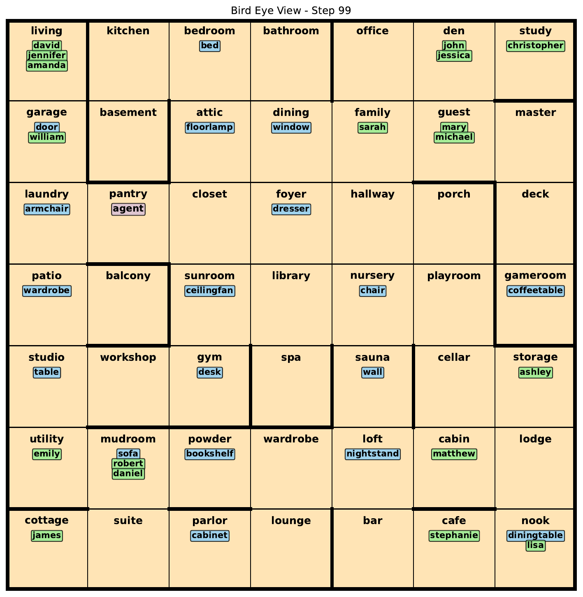
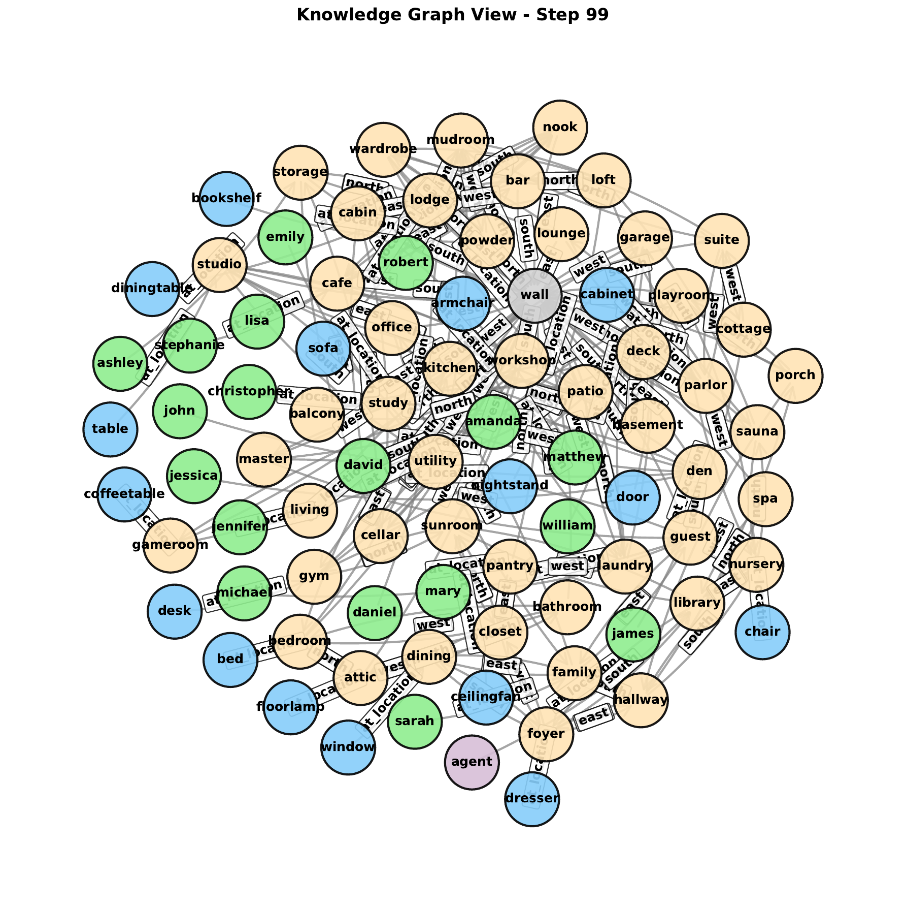
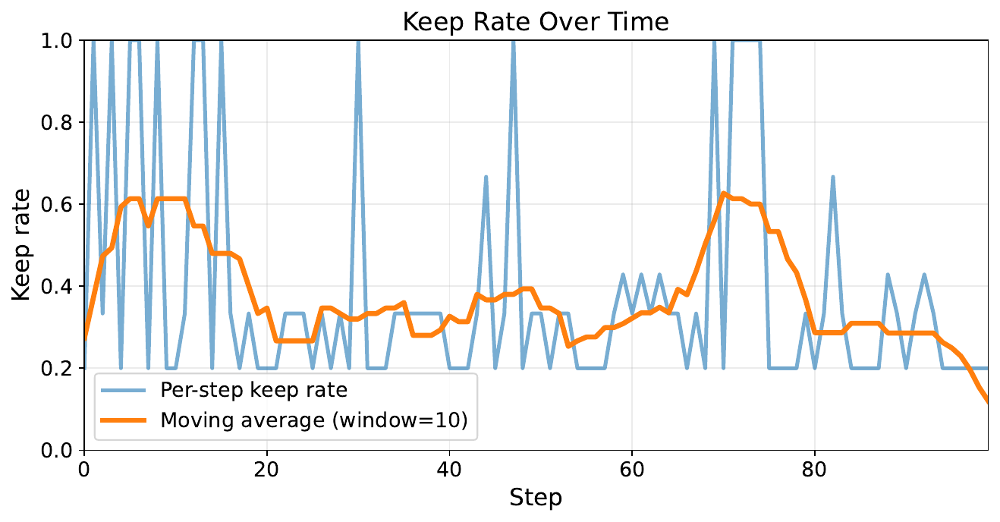
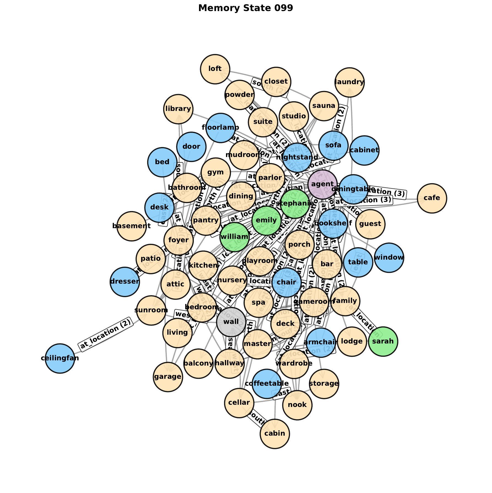

# KG Memory Transfer

**Authors:** [Taewoon Kim](https://taewoon.kim/), [Vincent Francois-Lavet](http://vincent.francois-l.be/), and [Michael Cochez](https://www.cochez.nl/).

Code for symbolic baselines and learned short-term-to-long-term memory transfer
policies that operate in [RoomEnv-v3](https://github.com/humemai/room-env), the
RoomKG benchmark.

For the research overview, see the [project page](https://humem.ai/projects/kg-memory-transfer)
or the paper on [arXiv](https://arxiv.org/abs/2605.22142).

This README focuses on the code, experiment entry points, evaluation flow, and
reproduced figures in this repository.

## Repository layout

- [`agent/`](./agent): symbolic agents, learned transfer agents, and shared neural modules
- [`run-symbolic.py`](./run-symbolic.py): symbolic transfer baselines used in the paper
- [`run-symbolic-simple.py`](./run-symbolic-simple.py): simplified symbolic baseline sweep
- [`run-dqn.py`](./run-dqn.py): train learned keep/drop transfer policies over explicit graph memory
- [`run-dqn-test.py`](./run-dqn-test.py): evaluate completed learned-transfer runs on held-out environments
- [`run-dqn-simple.py`](./run-dqn-simple.py): train sequence-based neural baselines (LSTM and Transformer)
- [`run-dqn-simple-test.py`](./run-dqn-simple-test.py): evaluate completed sequence baselines on held-out environments
- [`plot-symbolic.py`](./plot-symbolic.py), [`plot-dqn.py`](./plot-dqn.py), and [`plot-dqn-simple.py`](./plot-dqn-simple.py): aggregate experiment outputs into paper figures
- [`plot-results.py`](./plot-results.py): render memory-state graphs from saved test-time state traces
- [`figures/`](./figures): README figures and exported paper figures

## Prerequisites

1. Python 3.10 or higher
1. A virtual environment is recommended
1. Install the requirements with `pip install -r requirements.txt`

## Run experiments

Run the symbolic transfer baselines:

```sh
python run-symbolic.py --workers 4
```

Run the simplified symbolic baseline sweep:

```sh
python run-symbolic-simple.py --workers 4
```

Train the learned transfer agents:

```sh
python run-dqn.py --workers 4
```

Evaluate completed learned-transfer runs on the held-out environment:

```sh
python run-dqn-test.py --env large-02-q --workers 1
```

Train the sequence-based neural baselines on one environment configuration:

```sh
python run-dqn-simple.py --env large-02 --workers 4
```

Evaluate completed sequence baselines on the held-out environment:

```sh
python run-dqn-simple-test.py --env large-02-q --workers 1
```

The symbolic scripts write results under `training-results-symbolic/` and
`training-results-symbolic-simple/`. Learned transfer runs write outputs under
`training-results-dqn/`, and sequence baselines write outputs under
`training-results-simple-dqn/`.

## Paper setup

The public repository keeps the paper-scoped experiment surface rather than every
earlier exploratory variant.

- **Symbolic transfer baselines**: compare explicit remember policies such as `all`, `novel`, and `random_0.5`
- **Learned transfer agents**: train per-item keep/drop policies over short-term observations before long-term insertion
- **Sequence baselines**: compare LSTM and Transformer agents that learn from observation histories instead of explicit graph transfer
- **Held-out evaluation**: uses `large-02` for training and `large-02-q` for testing at long-term memory capacity 128

This setup isolates short-term-to-long-term transfer as the main learning problem while
keeping question answering, exploration, and eviction policies fixed enough for direct
comparison.

## Plotting and analysis

Aggregate the paper plots after experiments finish:

```sh
python plot-symbolic.py
python plot-dqn.py
python plot-dqn-simple.py
```

Render step-level memory-state graphs from a saved test trace:

```sh
python plot-results.py --states training-results-dqn/<run>/states_q_values_actions_test.yaml --limit 100
```

Replace `<run>` with the experiment directory produced by `run-dqn-test.py`.

## Results

| Hidden-state view | Knowledge-graph view |
| :---------------: | :------------------: |
|  |  |

| Keep rate over time for the learned transfer policy |
| :------------------------------------------------: |
|  |

| Final symbolic memory state after learned transfer decisions |
| :---------------------------------------------------------: |
|  |

In the paper setting, learned short-term-to-long-term transfer improves question
answering over both symbolic heuristics and sequence-based neural baselines while
remaining inspectable at the level of individual kept and dropped facts.

## Further reading

- [Project page](https://humem.ai/projects/kg-memory-transfer)
- [Paper on arXiv](https://arxiv.org/abs/2605.22142)
- [GitHub repository](https://github.com/humemai/kg-memory-transfer)
- [RoomEnv-v3 / RoomKG benchmark](https://github.com/humemai/room-env)

## Cite our paper

```bibtex
@misc{kim2026shorttermtolongtermmemorytransferknowledge,
      title={Short-Term-to-Long-Term Memory Transfer for Knowledge Graphs under Partial Observability}, 
      author={Taewoon Kim and Vincent François-Lavet and Michael Cochez},
      year={2026},
      eprint={2605.22142},
      archivePrefix={arXiv},
      primaryClass={cs.LG},
      url={https://arxiv.org/abs/2605.22142}, 
}
```
